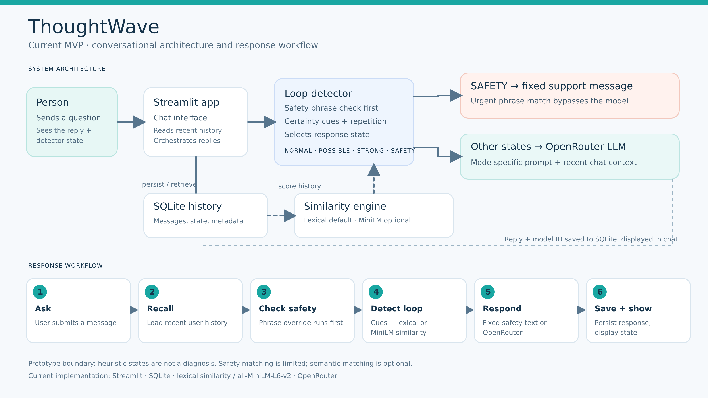

=======
# ThoughtWave-OCD-and-Intrusive-Thought-AI-Assistant
ThoughtWave is a support AI tool for adults that experience distressing Intrusive thoughts and urges to seek repeated reassurance. 

This solution comes in a form of an AI application that is built as an adaptive, LLM-Integrated adaptive conversational support system. Its core engineering problem is to be able to recognize when a conversation is beginning to function as a reassurance loop and be able to change its response policy before the AI assistant starts to reinforce the repeated certainty seeking.



# Run locally
Use Python 3.10 or newer. From the project directory:
```bash
python -m venv .venv
```
Activate the virtual environment:
```bash
# macOS / Linux
source .venv/bin/activate

# Windows PowerShell
.venv\Scripts\Activate.ps1
```
Then install dependencies, copy the configuration template, and start Streamlit:
```bash
python -m pip install -r requirements.txt
pip install streamlit   
cp .env.example .env         # Windows PowerShell: Copy-Item .env.example .env
streamlit run app.py
```
Edit `.env` before starting the app:
```dotenv
OPENROUTER\_API\_KEY=your\_openrouter\_key
OPENROUTER\_MODEL=openrouter/auto
HF\_TOKEN=
THOUGHTWAVE\_USE\_SEMANTIC=0
THOUGHTWAVE\_EMBEDDING\_MODEL=sentence-transformers/all-MiniLM-L6-v2
```
`OPENROUTER\_API\_KEY` is needed for normal chat replies. `HF\_TOKEN` is optional for downloading the public embedding model. Keep `THOUGHTWAVE\_USE\_SEMANTIC=0` for the default lexical detector; enable semantic matching in the app's sidebar when needed. The first model download can take time. If semantic loading fails, the app falls back to lexical similarity. Restart Streamlit after changing `.env`.
Do not commit `.env` or API tokens. Without valid OpenRouter configuration, the app reports an error rather than presenting a canned response as an AI answer.
Test
>>>>>>> a19a04804a49b3db5c5e972ddaec0922df93bc4e
